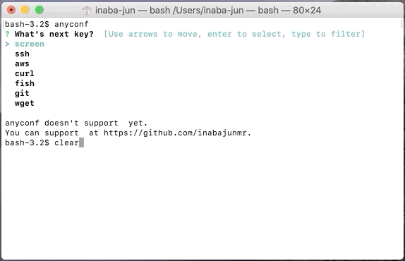

# anyconf

anyconf is a local configuration file finder.

## Install

```
go install github.com/inabajunmr/anyconf@latest
```

## Usage

When you want to edit the config file about AWS.

```
anyconf aws
```

### Example



### Local extension

When you want to add a config path to only your local environment, you can use the local config file.

```
vim ~/.anyconf/configs.txt
```

When you add a line to `~/.anyconf/configs.txt` like the following example, you can find yourtool on anyconf.

```
yourtool ~/yourtool/config
```

You can find and edit it via anyconf.

### Editor Configuration

The default editor is Vim.
If you want to use vscode and you can launch it by `code` command, you can configure it on `~/.anyconf/configs.yml` like the following example.

```
editor: code
```

You can find and edit it via anyconf too.

## Development

### Prerequisite

anyconf use [statik](https://github.com/rakyll/statik) for the build process.

### Build

After editing static/configs.txt, the following command is needed.
```
statik -src static
```

## Contribution

Please add a new config to [static/configs.txt](static/configs.txt).
When you want to add `~/.aws/config`, you can add a line like the following example.

```diff
aws/credentials ~/.aws/credentials
+ aws/config ~/.aws/config
fish ~/.config/fish/config.fish
git/config ~/.gitconfig
```

## License

[MIT](https://github.com/inabajunmr/anyconf/blob/main/LICENSE)

## Author

[inabajunmr](https://github.com/inabajunmr)
